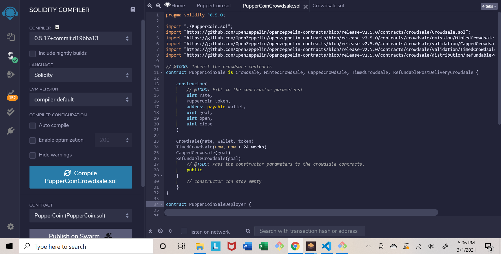
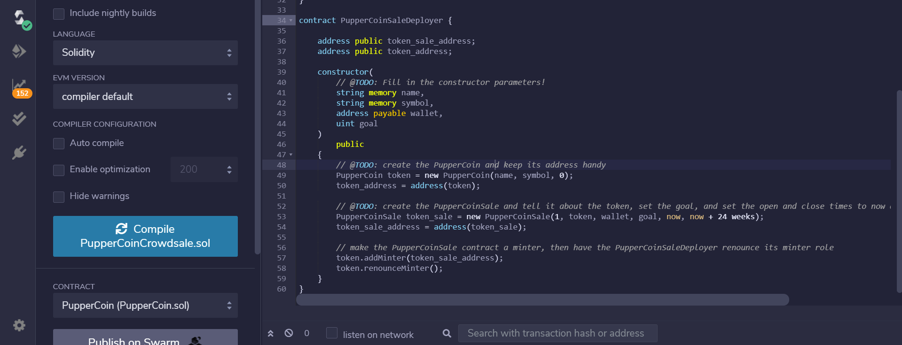
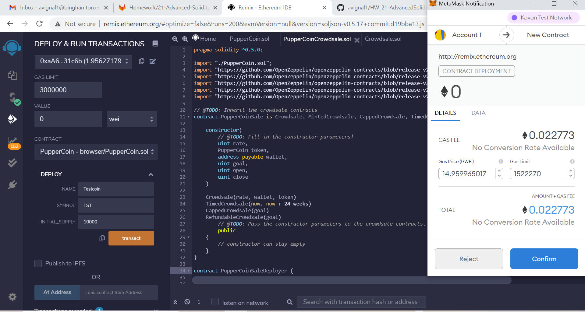
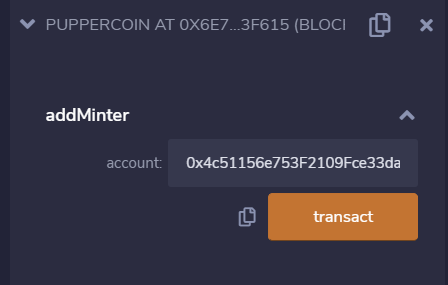
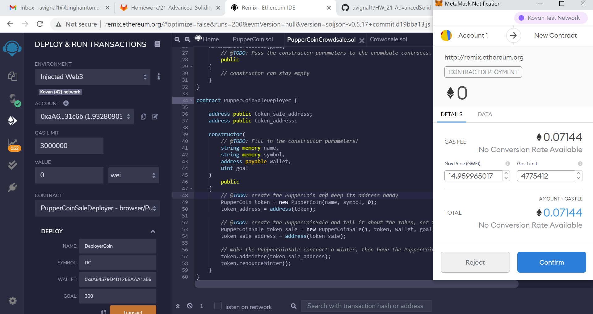
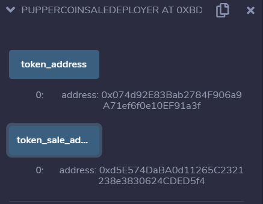
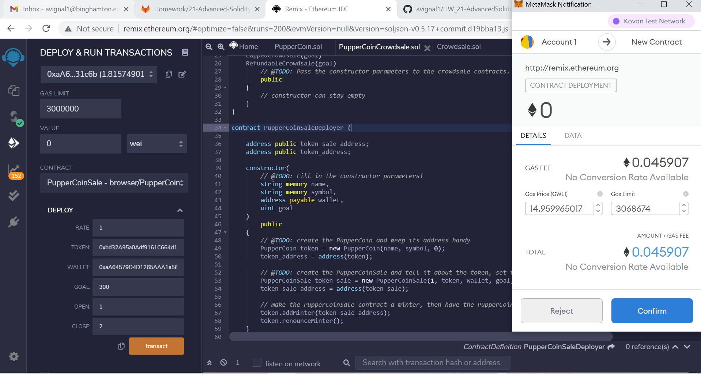

# Unit 21: Advanced Solidity

## Compiling SmartContract - PupperCoinCrowdsale.sol

## Deploying PupperCoinCrowdsale.sol

## Add Minter for new account (0x4c51156e753F2109Fce33daDd16c4E6Fc006469e)

## Deployment of PupperCoinSaleDeveloper 

## Token Addresses

## Deploying Third Contract - PupperCoinCrowdSale.sol
